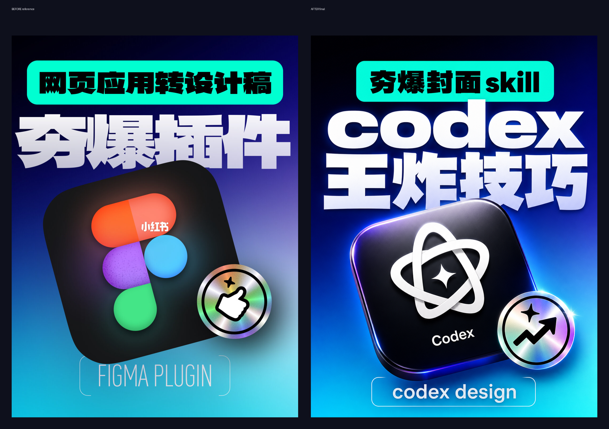

# 小红书封面创作助手

这是一个 Codex skill，用来按参考封面和新文案生成小红书封面。



核心流程：

1. 参考图负责确定版式、氛围、图标和文字层级。
2. AI 负责生成封面底图和主视觉。
3. 中文标题、副标题、底部文案优先本地排版，避免缺字、错字。
4. 输出 3:4 竖版小红书封面。

最简单的使用方式：

```text
用小红书封面创作，参考这张图，把标题改成：3个普通人也能用的AI写作方法
```

如果是人物封面，需要额外提供一张清晰本人照片。

## 案例

这次案例是把一张 Figma 插件风格的小红书封面，改成 Codex 主题封面。对比图如下：

| 原参考图 | 最终效果图 |
| --- | --- |
|  |  |

- 主标题：`codex 王炸技巧`
- 副标题：`夯爆封面 skill`
- 图标：换成 Codex 风格图标
- 底部：`codex design`

详细复盘见：[docs/case-study.md](docs/case-study.md)
